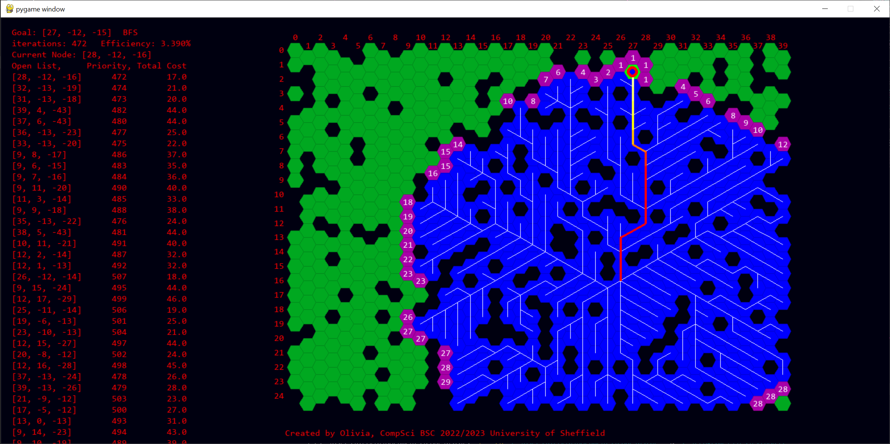

# Pathfinding visualisation

Showcases 4 pathfinding algorithms in a visual manner,
* BFS
* DFS
* Best First
* Depth First

## Setup and Installation
this program uses the following libraries

1. pygame 2.5.0
2. numpy==1.25.0

### Setup
`pip install -r requirements.txt`

### Installation
1. and then either `python app.py

## Running the code
There are four different programs

1. app.py - runs pathfinding on a hex grid
2. square_app.py - runs pathfinding on a square grid
3. app_double.py - compares Best First and A Star side by side on a hex grid
4. square_app_double.py - compares Best First and A Star side by side on a square grid

### Controls
All programs have the same set of key and mouse controls:

#### Keyboard
* s - Start/Stop simulation
* a - generate fewer walls
* d - generate more walls
* e - cycles to next algorithm (BFS, DFS, Best First, A Star)
* r - move start and goal position to random position
* v - regenerate map, starting location and goal location
* g - restart run with same map and positions
* b - randomise next starting and goal positions (toggle)
* f - regenerate next map (toggle)
* t - switch algorithm each run (toggle)
* c - show graph overlap (toggle)
* x - activate step by step mode (toggle) (press s to move to next step)

#### Mouse
All clicks must be done on a grid cell
* Left Click - switch between wall (impassable) or ground (passable)
* Middle Click - move starting position
* Right Click - move goal position

## Improvements that can be made

1. Add superclass for hex grid and square grid
2. Have the agent use the nodes that hex grid and square grid uses instead of it's own node class
3. Package all simulation files into one file, allowing one to switch between them
4. Write docstrings and comments
5. Include option to switch heuristic from straight line distance to manhattan distance
6. Include iterative deepening pathfinding algorithm
7. Rekey keyboard controls to make more sense
8. Include keyboard controls and status of toggles in GUI
9. Create clickable buttons for all keyboard options
